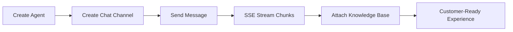

# AI Sandbox SDK for CSharp (.NET)


## UX-First Value Cards

| Quick Integration | Real-Time Experience | Reliability by Default |
| --- | --- | --- |
| Async-first API surface for modern .NET apps | `IAsyncEnumerable<string>` SSE streaming | Configurable retries and timeout for resilience |

## Visual Integration Flow



## 60-Second Quick Start

```csharp
using EGroupAI.AiSandbox.Sdk;

var client = new AiSandboxClient(
    Environment.GetEnvironmentVariable("AI_SANDBOX_BASE_URL") ?? "https://www.egroupai.com",
    Environment.GetEnvironmentVariable("AI_SANDBOX_API_KEY") ?? string.Empty
);

var agent = await client.CreateAgentAsync(new
{
    agentDisplayName = "Support Agent",
    agentDescription = "Handles customer inquiries"
});
var agentId = agent.RootElement.GetProperty("payload").GetProperty("agentId").GetInt32();

var channel = await client.CreateChatChannelAsync(agentId, new
{
    title = "Web Chat",
    visitorId = "visitor-001"
});
var channelId = channel.RootElement.GetProperty("payload").GetProperty("channelId").GetString();

await foreach (var chunk in client.SendChatStreamAsync(agentId, new
{
    channelId,
    message = "What is the return policy?",
    stream = true
}))
{
    Console.WriteLine(chunk);
}
```

## Installation

```bash
dotnet add package EGroupAI.AiSandbox.Sdk
```

## Snapshot

| Metric | Value |
| --- | --- |
| API Coverage | 11 operations (Agent / Chat / Knowledge Base) |
| Stream Mode | `text/event-stream` with `[DONE]` handling |
| Retry Safety | 429/5xx auto-retry for GET/HEAD + capped exponential backoff |
| Error Surface | `ApiException` with statusCode/responseBody/traceId |
| Validation | Production-host integration verified |

## Links

- [Official System Integration Docs](https://www.egroupai.com/ai-sandbox/system-integration)
- [30-Day Optimization Plan](docs/30D_OPTIMIZATION_PLAN.md)
- [Integration Guide](docs/INTEGRATION.md)
- [Quickstart Example](examples/Quickstart.cs)
- [Repository](https://github.com/eGroupAI/ai-sandbox-sdk-csharp)
